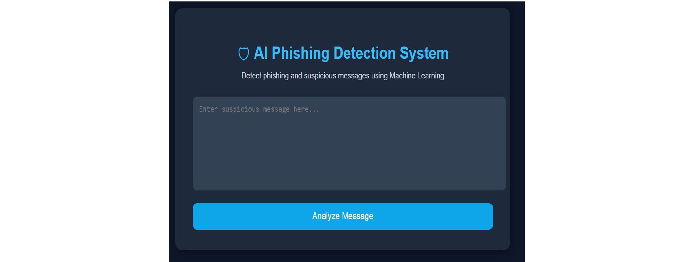
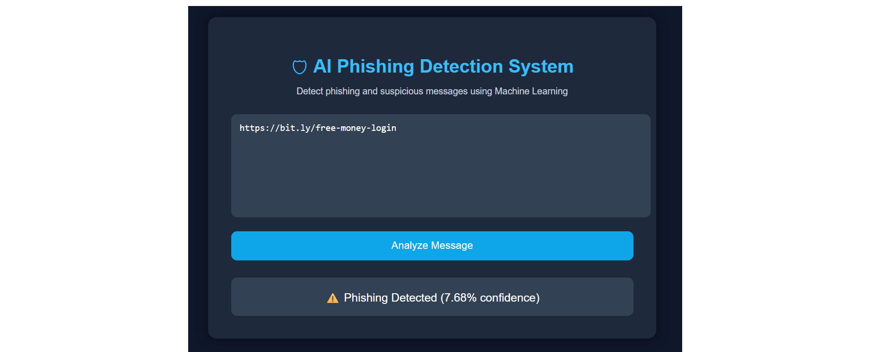
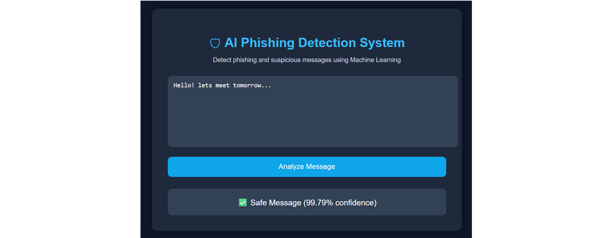
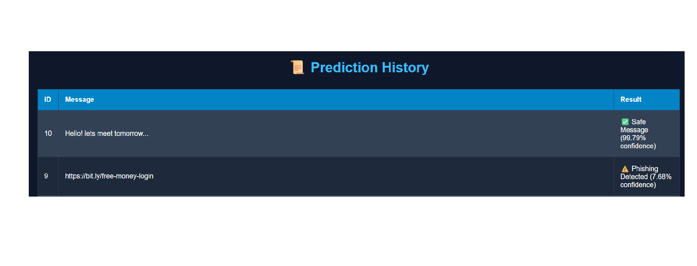

# 🛡 AI Phishing Detection System

An AI-powered phishing detection web application built using Python, Flask, Machine Learning, and SQLite.

The system detects phishing and suspicious messages using:
- Machine Learning classification
- URL pattern analysis
- Hybrid phishing detection logic
- Confidence score prediction

---

# 🚀 Live Demo

Deployed on Render:

https://ai-phishing-detection-system-1-4ckt.onrender.com

---

# 📌 Features

✅ AI-based phishing message detection  
✅ URL phishing detection  
✅ Confidence score prediction  
✅ Professional cybersecurity dashboard UI  
✅ Prediction history system  
✅ SQLite database integration  
✅ Real-time Flask web application  
✅ Render cloud deployment  

---

# 📸 Screenshots

## Dashboard



---

## Phishing Detection



---

## Safe Message Detection



---

## Prediction History



# 🧠 Machine Learning

The project uses:

- CountVectorizer
- Multinomial Naive Bayes
- Custom phishing dataset augmentation

Dataset:
- SMS Spam Collection Dataset
- Additional phishing-oriented custom samples

---

# 🛠 Tech Stack

## Frontend
- HTML
- CSS

## Backend
- Flask
- Python

## Machine Learning
- Scikit-learn
- Pandas
- NumPy

## Database
- SQLite

## Deployment
- Render
- GitHub

---

# 📂 Project Structure

```bash
AI-Phishing-Detector/
│
├── app.py
├── train_model.py
├── database.py
├── model.pkl
├── vectorizer.pkl
├── predictions.db
├── requirements.txt
│
├── dataset/
│   └── sms.tsv
│
├── templates/
│   ├── index.html
│   └── history.html
│
└── README.md
```

---

# ⚙ Installation

## Clone Repository

```bash
git clone https://github.com/riya-builds/AI-Phishing-Detection-System.git
```

---

## Create Virtual Environment

```bash
python -m venv venv
```

---

## Activate Virtual Environment

### Windows

```bash
venv\Scripts\activate
```

---

## Install Requirements

```bash
pip install -r requirements.txt
```

---

## Train Model

```bash
python train_model.py
```

---

## Create Database

```bash
python database.py
```

---

## Run Flask App

```bash
python app.py
```

---

# 🌐 Open in Browser

```bash
http://127.0.0.1:5000
```

---

# 📊 Future Improvements

- TF-IDF Vectorizer
- Deep Learning Models
- Real URL Reputation APIs
- Threat Intelligence Integration
- Docker Deployment
- User Authentication
- Analytics Dashboard

---

# 👩‍💻 Author

Riya Kumari
B.Tech CSE(Cybersecurity) Student